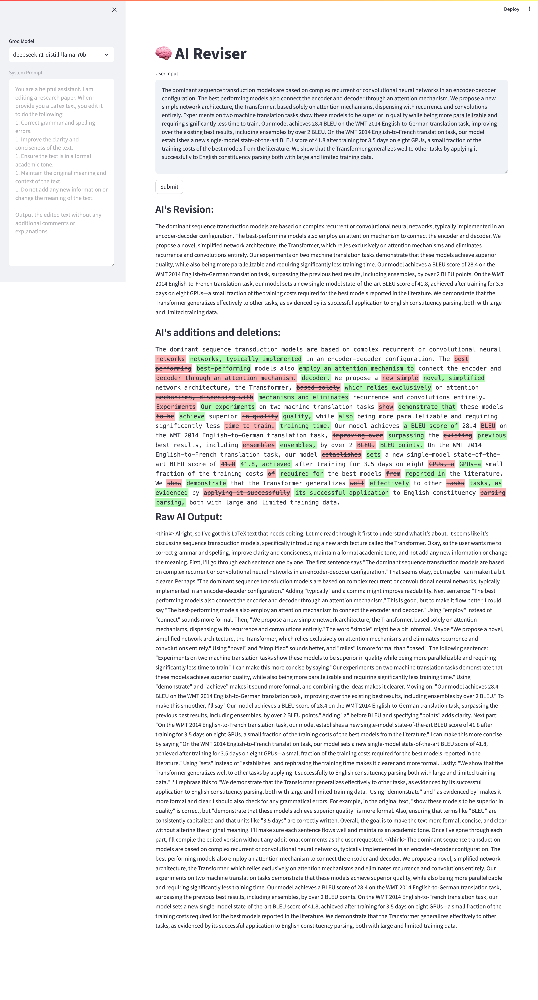

# AI Reviser with Colorful WordDiff

**If you find this project helpful or interesting, consider giving it a star! ⭐**

# Why AI Reviser?
* Most Offline/Online LLMs with CLI/GUI can edit your text but don't provide a nice visualization of the changes.
* Default diff tools like Git show charecter-level or line-level differences, which are not friendly to human eyes for text editing.
* AI Reviser is a simple tool that uses the Groq API to edit your text and visualize the changes in a human-friendly word-level diff format (See the example below).

# How to Use

1. Clone the repository.
1. Write your Groq API Key in `groq_api.txt` (This file is ignored by git so you are safeguarded against leaking your key).
1. Add your system prompt in `system_prompt.txt`.
1. Install missing libraries/dependencies yourself.
1. Run the script with `streamlit run app.py`.

# Example

